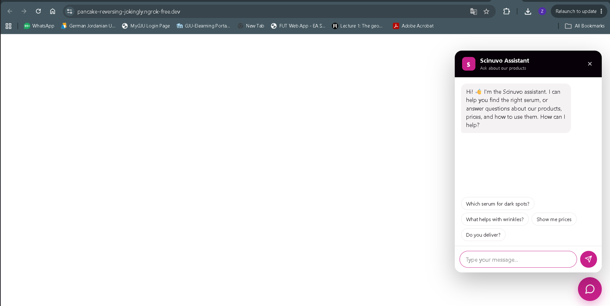

# Scinuvo Customer Chatbot

A bilingual (Arabic / English) customer-support chatbot for a skincare product
range. It answers questions about products, prices, usage, and routines, grounded
strictly in the company's own product data, and refuses medical advice.

Built with a Retrieval-Augmented Generation (RAG) pipeline: multilingual embeddings +
a vector database (ChromaDB) for retrieval, and Claude (Anthropic API) for generation.

## Demo

The assistant greets visitors, detects their language, offers quick starter questions,
and answers about the product range — in Arabic (right-to-left) or English.

**Running the demo:** start the server (`python app.py`) and open `http://localhost:5000`.
A temporary public link can be shared via ngrok while the server is running. A permanent,
always-on deployment is handled by the hosting steps below.

---

## Features

- **Bilingual (Arabic + English):** detects the customer's language and replies in it,
  with right-to-left rendering for Arabic. Understands casual/dialect phrasing.
- **Grounded answers:** responds only from the product knowledge base; says it doesn't
  have a detail rather than inventing one.
- **Safety guardrail:** refuses medical advice (diagnosis, treatment, condition safety)
  and redirects to a professional.
- **Conversation memory:** follows up correctly across a multi-turn chat.
- **Cost controls:** cheap model, per-user rate limiting, a daily cap, and short token limits.
- **Embeddable widget:** a self-contained chat bubble for any website.

---

## Tech stack

Python, Flask, ChromaDB (vector database), sentence-transformers (multilingual
embeddings), the Anthropic API (Claude), and a vanilla HTML/CSS/JS widget.

---

## What's in this repo

| File | Purpose |
|------|---------|
| `app.py` | The backend API (Flask). Serves `/chat` and the widget. |
| `widget.html` | The chat widget shown to customers. |
| `ingest.py` | Builds the vector database from the knowledge base. |
| `scinuvo_knowledge.jsonl` | The product knowledge base. |
| `scrape.py` | Pulls product data from the website to update the knowledge base. |
| `requirements.txt` | Python dependencies. |
| `.env.example` | Template for the API key (copy to `.env`). |

Not committed (see `.gitignore`): the real `.env`, the `venv/`, and the generated
`scinuvo_db/` database (rebuild it with `ingest.py`).

---

## Running it locally

1. Install Python 3.10+.
2. Create and activate a virtual environment:
   - Windows: `python -m venv venv` then `venv\Scripts\activate`
   - Linux/Mac: `python3 -m venv venv` then `source venv/bin/activate`
3. Install dependencies: `pip install -r requirements.txt`
4. Set the API key (get one from console.anthropic.com):
   - Copy `.env.example` to `.env` and put the key in it, **or**
   - Set the environment variable `ANTHROPIC_API_KEY` directly.
5. Build the database: `python ingest.py`
6. Start the server: `python app.py`
7. Open `http://localhost:5000` — the widget loads and works.

---

## Deploying to production

The included server is Flask's development server — **do not use it as-is in production.**
For a real deployment:

1. **Run behind a production WSGI server**, e.g. `waitress` (Windows) or `gunicorn` (Linux):
   `pip install waitress` then `waitress-serve --port=5000 app:app`
2. **Serve over HTTPS** (behind Nginx / a load balancer / the host's TLS).
3. **Store the API key as a secret** on the host (environment variable), never in the code.
4. **Lock down allowed origins.** In `app.py`, set `ALLOWED_ORIGINS` to the real site domain(s).
5. **Point the widget at the backend.** In `widget.html`, set `API_URL` to the deployed
   backend URL, then embed the widget into the website's pages.
6. **Rate limits & daily cap** are in-memory (fine for one server). For multiple instances,
   move the counters in `app.py` to a shared store (e.g. Redis).

### Cost controls (already built in)
- Model: Claude Haiku (cheapest).
- `MAX_TOKENS`, `TOP_K`, `MAX_HISTORY`, `DAILY_GLOBAL_CAP`, `PER_IP_PER_MINUTE`,
  `PER_IP_PER_DAY` are configurable at the top of `app.py`.
- Also set a hard monthly spending limit in the Anthropic console as the final backstop.

---

## Updating product data

1. `python scrape.py` — pulls current product pages into `scraped_products.json`.
2. Review, then regenerate `scinuvo_knowledge.jsonl`.
3. `python ingest.py` — rebuilds the database.
4. Restart the server.

To scale to more products, raise `END_ID` in `scrape.py`.

---

## Before going live — checklist

- [ ] Content approved by someone with authority for the product/brand.
- [ ] Anthropic monthly spending cap set.
- [ ] HTTPS enabled and allowed-origins locked to the production domain.
- [ ] API key stored as a host secret, not in the repo.
- [ ] Tested with real Arabic and English questions, including medical questions
      (it must refuse and redirect to a professional).

---

## Safety design notes

- The bot answers **only** from the knowledge base (grounded); it says it doesn't have a
  detail rather than invent one.
- It **refuses medical advice** and redirects to a professional.
- Product claims reflect the brand's own published content and should be kept in sync
  with what the company approves.

##Contributors
- Talal Rahahleh (https://github.com/talalrahahleh)
